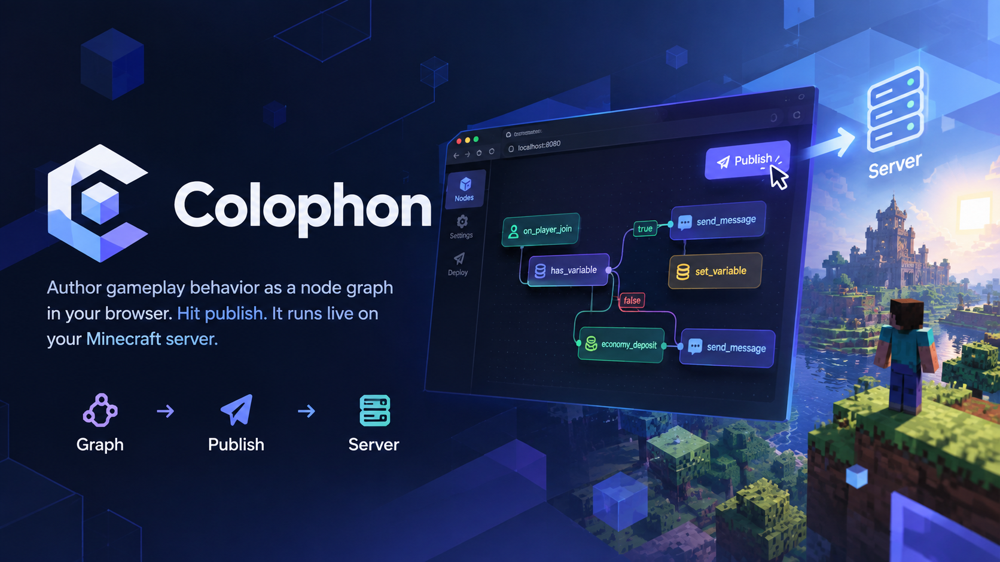
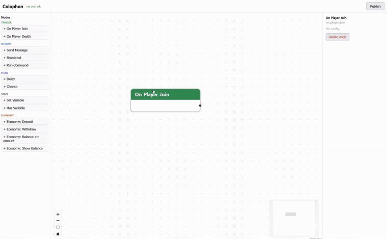
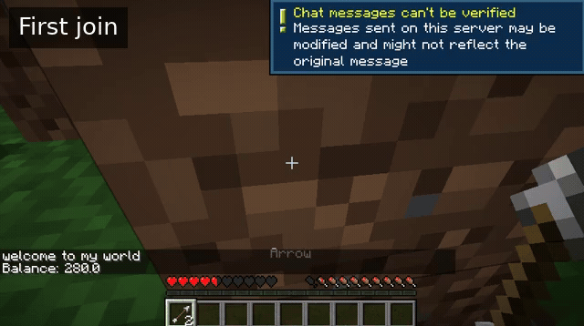

<p align="center">
  
</p>

<p align="center">
  
  
  
  
</p>

Colophon is a NeoForge mod that turns server-side gameplay logic into a visual, node-based editor. You wire up triggers, actions, flow, economy, and persistent state in a web canvas, click **Publish**, and the behavior takes effect on a running server — no restart, no code.

> A NeoForge reimagining of the editor idea behind Paper's *Typewriter* — rebuilt from scratch as an editor-first platform. NPCs and dialogue typing are intentionally out of scope; Colophon is about the graph → publish → server loop.

---

## Demo

Two short clips — authoring in the browser, then the result on a live server.

**1 — Authoring (web editor)**

<p align="center">
  
</p>

Drag nodes onto the canvas, wire the flow, configure fields, and hit **Publish**.

**2 — In-game (server)**

<p align="center">
  
</p>

The published graph runs live: a first-join allowance, remembered return visits (survives reconnect and restart), and a death penalty.

---

## What it does

- **Visual authoring, live publish.** Build a node graph in the browser; `Publish` writes it to the server and it takes effect immediately.
- **Typed port connections.** Connections are validated by a typed-port model, so trigger→trigger and other invalid wirings are blocked as you build.
- **Persistent state that survives restarts.** Player and global variables are stored durably (embedded H2) and flushed in lockstep with the world save, so your data and the world are always aligned to the same snapshot.
- **Graceful by design.** Bad input or a not-yet-ready value produces a *defined* result, not an exception — the server doesn't crash on an author's mistake.
- **Optional economy integration.** Economy nodes work through [Impactor](https://modrinth.com/mod/impactor) when it's installed, guarded by a soft dependency check.

### Node library

| Category | Nodes |
|----------|-------|
| Trigger  | `on_player_join`, `on_player_death` |
| Action   | `send_message`, `broadcast`, `run_command` |
| Flow     | `delay`, `chance` |
| State    | `set_variable`, `has_variable` |
| Economy  | `economy_deposit`, `economy_withdraw`, `economy_has_balance`, `economy_show_balance` |

---

## Example: a first-join allowance

The graph in the demo, described in words:

1. `on_player_join` → `has_variable "visited"` (scope: PLAYER)
2. **First time** (unset branch) → `economy_deposit 50` → `economy_show_balance` → `send_message "Welcome! Here's your starter allowance."` → `set_variable "visited" = true`
3. **Returning** (set branch) → `send_message "Welcome back."`
4. `on_player_death` → `economy_withdraw 10` → `send_message "You dropped 10 coins."`

Reconnect and the server remembers you; restart the server and it still remembers — the state is persisted, not just held in memory.

---

## How it works

```
Browser editor  ──HTTP──▶  Colophon (NeoForge server mod)
(React + React Flow)         │
   graph.json                ├─ HttpServer (JDK built-in, no deps) — serves editor, /api/graph
   (publish)                 ├─ Runtime: main-thread tick scheduler
                             │    Node.execute → NodeResult (Continue / Branch / Suspend / Done / Fail)
                             │    per-tick node budget guards against runaway loops
                             ├─ NodeRegistry — engine runs on abstract nodes; concrete nodes plug in
                             └─ State layer — PLAYER / GLOBAL / LOCAL scopes
                                  StateBackend (swap seam) → H2, flush aligned to world save
```

- **Editor** is a React + React Flow app bundled to a single `index.html` (Vite + `vite-plugin-singlefile`) and packaged as a generated resource by Gradle.
- **Runtime** is a tick scheduler on the server main thread. Each node returns a `NodeResult`; `Suspend` lets a node wait (e.g. for an async economy call to finish) and resume without blocking the tick.
- **Definitions vs. state are separated.** The authored graph lives in `config/colophon/graph.json`; runtime state lives in its own store.
- **State backend is a seam.** `StateBackend` is a single interface; today it's embedded H2 for single-server. The key structure and batched dirty-flush are shaped so a shared DB could drop in for multi-server later, without touching the rest.

---

## Build

Requirements: **JDK 21**, and the bundled Gradle wrapper.

```bash
./gradlew build
```

The editor front-end is built and packaged into the mod jar automatically (`buildEditor` / `packEditor`). The resulting jar embeds its runtime dependencies (jarJar). Drop it into a NeoForge 1.21.1 server's `mods/` folder; the editor is served on port `8080`.

For economy nodes, install [Impactor](https://modrinth.com/mod/impactor) on the server (optional).

---

## Status

Colophon is a **personal project**, released as a complete, working piece. The visual editor, the runtime engine, the full node library, and a state layer that survives reconnect and restart are all done and verified end-to-end.

- ✅ Visual editor — typed-port validation, publish, load/save
- ✅ Runtime engine — trigger / action / flow / economy / state nodes
- ✅ Persistent state (PLAYER / GLOBAL / LOCAL), durable across reconnect and restart

## Roadmap

Directions the design already accounts for. The architecture leaves a seam for each, so they can be picked up without reshaping the core.

- [ ] **Typed data ports** — pass typed values between nodes, not just flow. The core↔addon SDK contract is designed (a pure/impure node split, a typed value store, an open type registry).
- [ ] **Trigger payloads as data** — expose `on_player_death`'s victim/killer, explicit player selection, and similar context.
- [ ] **Variable registry** — declare and manage variables in the editor (dropdowns, no key typos) for larger servers.
- [ ] **Authoring UX** — live validation warnings in the editor (over WebSocket), text template interpolation.
- [ ] **Multi-server** — a shared-DB backend behind the existing `StateBackend` seam, plus Redis cross-server cache invalidation.
- [ ] **More nodes** — additional triggers, actions, and economy / integration adapters.

Ideas, issues, and "I'd use this if it did X" notes are welcome.

---

## License

[MPL-2.0](LICENSE) — file-level copyleft. Forks of the core stay open; addons and private integrations that link against it are free to be licensed as you like.

Author: **Liminaire**
