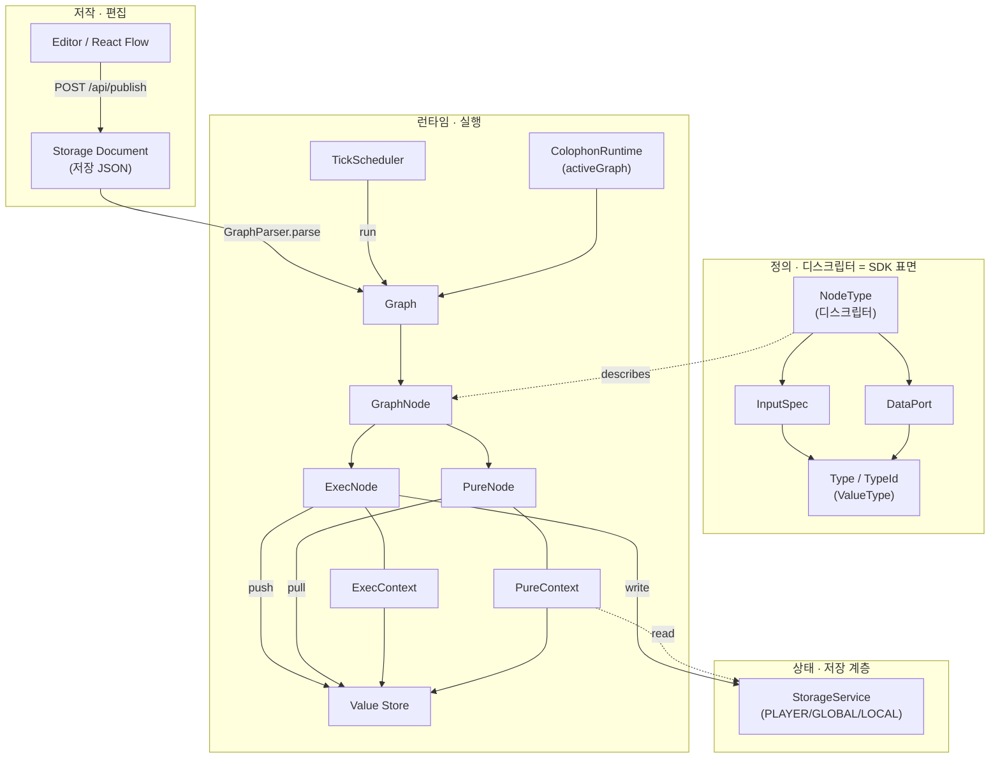
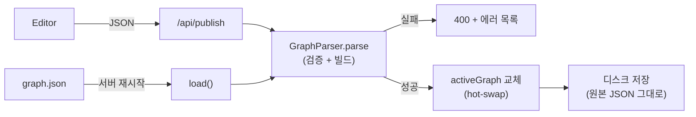
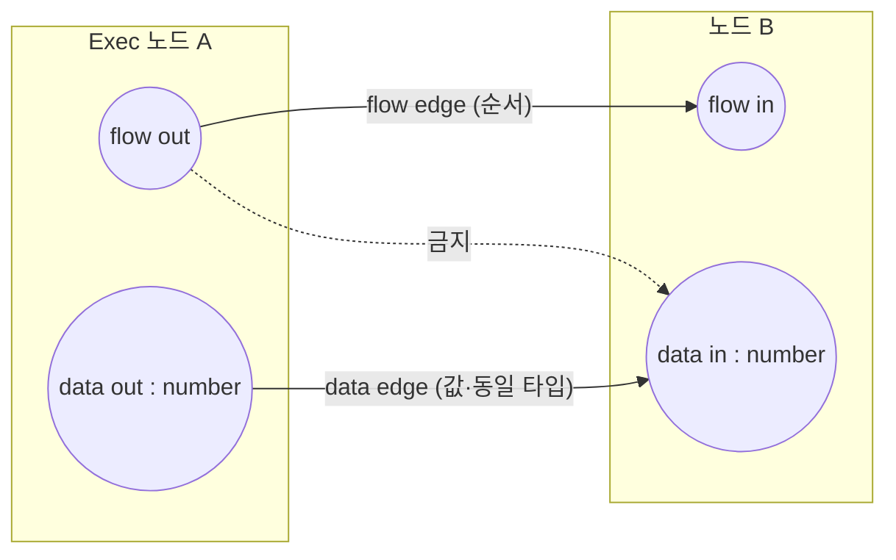
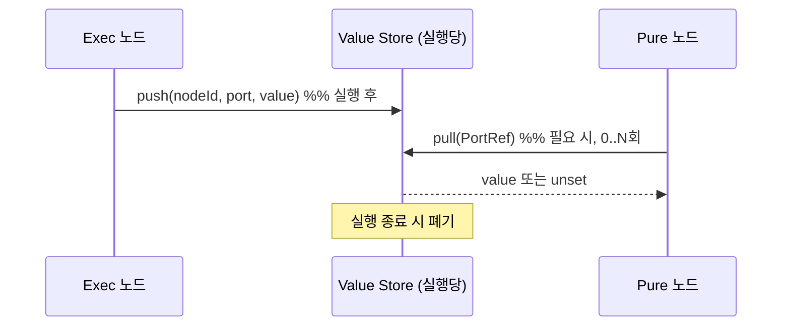
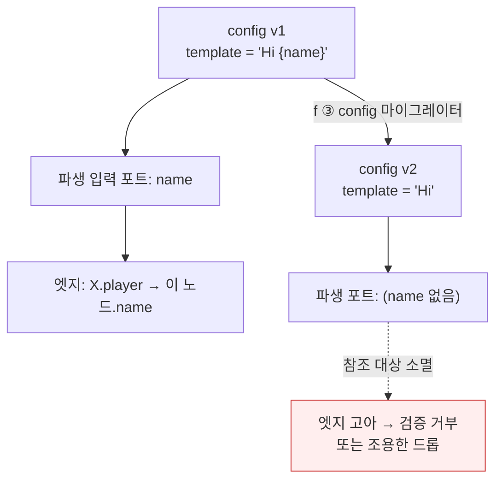
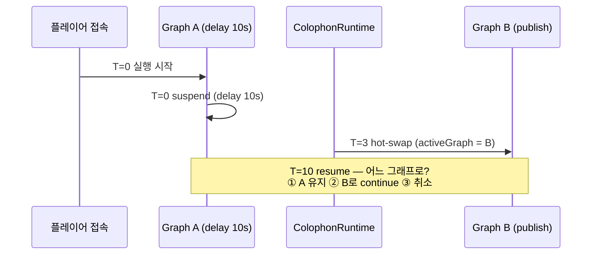

# 도메인 모델 — 개념·계약·상태 (스켈레톤)

> **이 문서의 역할**: Colophon의 **명사(개념)들과 각자의 계약**을 한 곳에 모아, "무엇이
> 잠겼고 무엇이 열렸는지"를 한 화면에서 본다. **근거·기각 대안은 [decisions/](decisions/)**,
> **왜·스택·구조는 [architecture.md](architecture.md)**, 이 문서는 그 사이 — *언어의
> 어휘집*이다. 각 개념은 링크로 ADR·코드를 가리키고 여기서 중복 서술하지 않는다.
>
> **상태 범례**: 🔒 잠김(계약) · 🟡 부분 정의 · 🔴 열림(미정) · ⚠️ 위험/상호작용 주의
>
> **스켈레톤 주의**: 잠긴 개념은 계약을 채웠고, 열린 개념은 **핵심 질문만** 박아둔 자리다.
> `TODO`는 다음에 채운다. 배경: 적대적 리뷰 → [0005-storage-format-DRAFT.md](decisions/0005-storage-format-DRAFT.md) §10.

---

## 0. 도메인 개념 맵

세 층 — **저작(Editor)** / **정의(디스크립터=SDK 표면)** / **런타임(실행)** — 과 그 사이를
잇는 **저장 문서**·**파서**.

**개념 목록(§2 순서)**: NodeType · Node · Port · Type/ValueType · InputSpec/DataPort ·
동적 포트 · Graph/GraphNode · Value Store · ExecContext/PureContext · Execution(Scheduler·
Suspend·async push) · Trigger · Storage Document · Hot-swap · Runtime State/영속 scope ·
SDK 경계 · Editor.

---

## 1. 파이프라인 한눈에 (publish · load)

> f가 이 그림에 추가할 것: `parse` **앞**의 마이그레이션 단계(JSON→JSON), `/api/validate`
> (SWAP·SAVE 없는 드라이런), 저장 포맷/버전. → [0005 초안](decisions/0005-storage-format-DRAFT.md).

---

## 2. 개념별 계약

각 항목: **정의 / 계약 / 근거 / 상태 / 열린 질문**.

### 2.1 NodeType — 디스크립터 🔒 (+🔴 네임스페이스)
- **정의**: 노드 *종류* 의 정의. 그래프엔 저장되지 않고 `nodeType` 문자열로 참조만 됨.
- **계약**: 두 종류로 **컴파일러 강제 분리** — `ExecNodeType`(flow+부작용) / `PureNodeType`
  (순수 값). base는 공유분(id·label·category·inputs·dataOutPorts)만.
- **근거**: [0001 계약 a](decisions/0001-data-port-contract.md) · [NodeType.java](../src/main/java/kr/guinnessgroup/colophon/runtime/NodeType.java)
- **상태**: 종류 분리 🔒 / **id 네임스페이스 🔴**
- **열린 질문**: 현재 id는 bare(`get_balance`). 애드온이 생기면 `economy:get_balance` vs
  `quest:get_balance` 충돌 = **저장 데이터 충돌**. `namespace:id`(NeoForge ResourceLocation
  풍) 도입 여부·시점 → **저장 정체성이므로 [0005](decisions/0005-storage-format-DRAFT.md)에서 결정.**

### 2.2 Node (인스턴스) — GraphNode 🔒 (+🔴 영속 state)
- **정의**: 캔버스에 놓인 한 개. `{id, nodeType, config}` (+ 에디터 UI 필드).
- **계약**: `id` 고유 / `nodeType` = 디스크립터 참조 문자열 / `config` = 저장 형식(JSON).
- **근거**: [0001 계약 c·d](decisions/0001-data-port-contract.md) · [GraphNode.java](../src/main/java/kr/guinnessgroup/colophon/runtime/GraphNode.java)
- **상태**: 구조 🔒 / **영속 노드 state 위치 🔴**
- **열린 질문**: counter·cooldown·once 같은 **노드 자체 상태**는 어디 사나? (config /
  runtime instance / ExecContext / StorageService?) 현재는 없음 → §2.14로.

### 2.3 Port — flow / data 🔒
- **정의**: 노드의 입출력. 두 **범주**: flow(실행 순서) / data(타입 있는 값).
- **계약**: flow↔data **교차 연결 금지**. data 엣지는 **같은 타입**만. data 입력=단일 와이어,
  data 출력=fan-out. 소스 핸들 검증은 `instanceOutputs`, 타깃은 `instanceInputs` 기준.
- **포트 ID**: **불변 semantic 문자열**(위치·라벨 아님, protobuf 번호처럼 고정). ✅ 지켜짐.
- **근거**: [0001 계약 b·e](decisions/0001-data-port-contract.md) · [GraphParser.java](../src/main/java/kr/guinnessgroup/colophon/runtime/GraphParser.java)

### 2.4 Type / ValueType 🔒 (⚠️ number=double)
- **정의**: 데이터 포트의 타입. 열린 `TypeRegistry`, **명목 매칭**(서브타이핑 없음).
- **계약**: 값(string/number/boolean, bare id) vs 참조(player=UUID, 네임스페이스 id,
  resolve 실패=unset, serializable=false). **단일 number = double(decimal)**. 연결 시점
  O(1) 검증, 암묵 자동변환 없음(값→텍스트는 전용 `format_text`).
- **근거**: [0002 타입 시스템](decisions/0002-type-system.md) · TypeId/Types
- **상태**: 명목 매칭 🔒 / **number=double ⚠️(재검토 후보)**
- **⚠️ 위험**: 정수 타입 없음 → count/index/loop가 double(부동소수 `==`·누적오차).
  통화는 내부 BigDecimal이나 포트 경계에서 `.doubleValue()` 다운캐스트([get_balance L58](../src/main/java/kr/guinnessgroup/colophon/nodes/economy/EconomyGetBalanceNode.java#L58))
  → 그래프 내 잔액 연산 시 float 오차. **방어 가능**(게임 로직 관용)하나 되돌리기 비쌈.
  나중에 `int`를 **additive**로 여는 문은 명목 매칭이라 열려 있음.
- **열린 질문**: number=double이 경제 정밀도까지 눈 뜨고 내린 결정인지 근거 명시. TODO.

### 2.5 InputSpec / DataPort 🔒
- **정의**: `InputSpec` = 통합 입력(config 노브 + 데이터 입력 한 목록). `DataPort` = 타입 있는
  데이터 출력. 둘 다 `id`(semantic)·`typeId`·`label` 보유.
- **계약**: `connectable=true`면 데이터 입력(와이어 가능), false면 인라인 config 노브. 입력은
  `FieldSpec`을 흡수한 **단일 소스**(contract d).
- **근거**: [0001 계약 d](decisions/0001-data-port-contract.md) · InputSpec/DataPort
- **상태**: 🔒

### 2.6 동적 포트 (instanceInputs / instanceOutputs) 🔒 ⚠️
- **정의**: 인스턴스의 **config에서 파생**되는 포트(예: `format_text` 템플릿 토큰이 입력
  포트로, `player_info` 선택 출력).
- **계약**: 파서·resolver는 정적 `inputs()`가 아니라 `instanceInputs(config)`/
  `instanceOutputs(config)`를 본다. 스키마엔 정적 포트만 노출, 나머지는 인스턴스별 파생.
- **근거**: [0003 값 흐름](decisions/0003-value-flow.md) · [NodeType.java L49-72](../src/main/java/kr/guinnessgroup/colophon/runtime/NodeType.java#L49)
- **상태**: 🔒 / **마이그레이션 상호작용 ⚠️(§3.1 지뢰)**
- **⚠️ 위험**: config가 바뀌면 파생 포트 집합이 바뀜 → **엣지 고아**. f 마이그레이션의 핵심
  제약. → §3.1.

### 2.7 Graph / GraphNode 🔒
- **정의**: `parse` 결과 실행 가능 모델. `Graph` = id→`GraphNode` 맵. `GraphNode` = 노드 +
  디스크립터 + (Exec|Pure) 인스턴스 + config + flow 배선 + data 소스 배선.
- **계약**: 파싱 시점에 flow 배선(source→port→target)과 data 소스(target 입력→producer
  `PortRef`)를 확정. 검증 실패 = 전체 거부(부분 로드 없음).
- **근거**: [GraphParser.java](../src/main/java/kr/guinnessgroup/colophon/runtime/GraphParser.java) · Graph/GraphNode
- **상태**: 🔒 / **Graph(소스 문서) ↔ CompiledGraph(런타임) 분리 여부 🔴** (리뷰 §29 — 현재
  parse가 곧 런타임 빌드. 분리 도입 여부는 열림, 과설계 경계 주의.)

### 2.8 Value Store 🔒
- **정의**: 실행당 하나의 값 저장소. exec가 write(push), pure가 read(pull). `PortRef`로 주소.
- **계약**: **수명 = 플로우 실행 전체**(실행 끝나면 폐기). exec 데이터 출력은 그 노드 **실행
  후에만** 유효 → 미실행 소비 = unset = 정의된 결과. 실행 간 지속 없음(그건 StorageService).
- **근거**: [0001 계약 a](decisions/0001-data-port-contract.md) · ValueStore/PortRef/ValueResolver

### 2.9 ExecContext / PureContext 🔒
- **정의**: 노드가 받는 능력 경계. Exec=전체 `ExecContext`(server·actor·storage write·suspend·
  values), Pure=**읽기 전용 `PureContext`**(storage read·values pull만).
- **계약**: **강제 수단 = 컨텍스트 능력 분리**. PureNode는 PureContext만 받아 suspend·월드
  변경·storage write를 **물리적으로 호출 불가** → "순수" 보장.
- **근거**: [0001 계약 a](decisions/0001-data-port-contract.md) · ExecContext/PureContext
- **상태**: 🔒 / **context lifetime 명세 🟡**(값 store는 실행당이나, 스레드 안전·메인스레드
  마샬링은 [discussions](discussions.md) "실행 계층"에서 열림)

### 2.10 Execution — Scheduler / Suspend / async push 🔒 (⚠️ hot-swap)
- **정의**: 트리거 발화 → `ExecContext` 생성 → `TickScheduler.start(graph, ctx, id)` → 플로우
  진행. Suspend(delay·await)로 중단·재개.
- **계약**: async 생산자는 **Exec가 값을 push**(`Suspend.onResume`/`Nodes.awaitValue`),
  pure는 동기. 순수 노드는 **실행당 0..N회 호출을 견뎌야** 함(캐시 보장 없음). "순수" =
  부작용 없음 + 동기, **참조 투명성 아님**(비결정 허용, 예: get_balance는 Exec).
- **근거**: [0003 값 흐름](decisions/0003-value-flow.md) · TickScheduler/NodeResult/Suspend
- **상태**: 실행·async push 🔒 / **hot-swap 중 진행 실행 semantics 🔴** → §3.2

### 2.11 Trigger 🔒
- **정의**: 이벤트 진입점(예: `on_player_join`, `on_player_death`). flow-in 없음.
- **계약**: 트리거는 이벤트 **주체를 이름 있는 데이터 출력**으로 push(death→victim/killer,
  join→player). 주체는 값(마법 아님), 참조 입력은 **명시 연결**(문맥 기본값 없음, 미연결=unset).
  = 블루프린트 − self.
- **근거**: [0001 계약 d](decisions/0001-data-port-contract.md) · [ColophonRuntime.fireTrigger](../src/main/java/kr/guinnessgroup/colophon/runtime/ColophonRuntime.java#L109)

### 2.12 Storage Document — 저장 포맷 🔴 (결정 중)
- **정의**: 디스크에 남는 그래프 문서. **현재 = 에디터(React Flow) 문서 그대로**(런타임
  시맨틱 + UI 필드 혼재).
- **현 상태**: 런타임은 dumb store — 원본 문자열 verbatim 저장·재전송. 자체 직렬화 모델 없음.
- **근거**: [0005 초안](decisions/0005-storage-format-DRAFT.md) · [ColophonRuntime](../src/main/java/kr/guinnessgroup/colophon/runtime/ColophonRuntime.java)
- **상태**: 🔴 **f의 핵심 결정** — A(패스스루) / B(정규화) / C(하이브리드) / **C+(GraphDocument
  1급 포맷)**. 적대적 리뷰 결론: "GraphDocument를 React Flow와 독립된 1급 포맷으로 인정할지"가
  진짜 질문.
- **열린 질문(→0005)**: 저장 포맷 · version 위치(node.schemaVersion / formatVersion / revision)
  · UI 필드 분리(`editor` 네임스페이스) · 마이그레이션 되쓰기(lazy vs publish-only) · atomic
  write. TODO: 0005 확정 시 여기 요약 반영.

### 2.13 Hot-swap 🔴 ⚠️
- **정의**: publish가 활성 그래프를 재시작 없이 교체.
- **현 상태**: `parse → activeGraph 교체 → save`. **불변식/진행 실행 정책 미정.**
- **상태**: 🔴 → §3.2 (지뢰)
- **열린 질문**: (1) 교체는 **완성된 새 그래프 ↔ 현재 그래프 원자 교체**여야(교체 후 추가
  검증 금지). (2) 진행 중 실행(delay/await/timer)이 어느 그래프를 참조? (옛 continuation 유지
  vs 신 그래프 vs 취소). (3) 다중 에디터 동시 publish(stale) 검출(revision). → 별도 ADR 후보.

### 2.14 Runtime State / 영속 scope 🟡🔴
- **정의**: 실행을 넘어 지속되는 상태.
- **계약(있는 것)**: `StorageService` — 스코프 3종(LOCAL=SavedData / PLAYER·GLOBAL=H2),
  라이프사이클 훅(join 로드 / save flush / quit markOffline), warn+skip 정책. `set_variable`/
  `get_variable`/`has_variable`.
- **근거**: [architecture.md](architecture.md) · runtime/state
- **상태**: 변수 스토리지 🔒 / **노드 자체 state·외부 리소스(timer/listener) lifecycle 🔴**
- **열린 질문**: 노드가 만든 외부 리소스(timer·subscription)의 정리 시점(그래프 unload 시
  `ResourceScope`?) — hot-swap 누수 방지와 직결(리뷰 §27). TODO.

### 2.15 SDK 경계 (api / core) 🔴
- **정의**: 애드온이 의존할 **공개 표면** vs 런타임 **내부 구현**.
- **현 상태**: `api`/`core` 패키지 **비어 있음**(추출 나중). 애드온은 아직 `runtime` 직접 참조.
- **상태**: 🔴 (의도적 지연)
- **열린 질문**: 애드온이 내부 클래스 대신 공개 계약에만 의존하게 하는 경계(Node/Type/Context/
  Migration/Diagnostic API). 지금 잠글 것 = **저장에 박히는 정체성**(node namespace·port id·
  type id)뿐, 나머지 SDK 형태는 additive. 리뷰 §16·§26. → ideas 백로그.

### 2.16 Editor 🔒(외부 계약) / 🟡(포맷 결합)
- **정의**: React + React Flow 웹 에디터. 스키마(`/api/schema`)로 팔레트 구성, publish로 전송,
  `/api/graph`로 로드(position 복원).
- **계약**: publish 페이로드 모양([App.jsx publish](../editor/src/App.jsx)) · position을 서버에
  위탁 보관(재로드 시 복원).
- **상태**: 동작 🔒 / **저장 포맷과의 결합 🟡** → 2.12에서 분리 논의.

---

## 3. 교차 위험 (개념 상호작용) ⚠️

개별 계약은 멀쩡한데 **둘이 만나면** 생기는 지뢰. 잠긴 계약 감사(§치명 문제 점검)의 산물.

### 3.1 동적 포트 × 마이그레이션 = 엣지 고아 ⚠️ (f 필수 처리)

config가 파생 포트를 정하는데(§2.6), f의 config 마이그레이터가 config를 바꾸면 파생 포트가
사라져 **그 포트를 참조하던 엣지가 조용히 끊긴다** — 옛 파일이 아니라 **마이그레이션이 스스로
유발**하는 손상.

**계약(제안, 0005/f에서 확정)**: *config를 바꾸는 마이그레이터는 그 config에서 파생되는
포트를 참조하는 엣지도 함께 손본다.* 안 그러면 마이그레이션이 그래프를 손상.

### 3.2 async 값 push × hot-swap = 미아 continuation ⚠️

`Suspend.onResume`로 중단된 실행은 **옛 그래프로의 continuation**을 쥔다(§2.10). hot-swap이
`activeGraph`를 갈아끼우면 그 실행의 운명이 미정.

**열린 질문(→ hot-swap ADR)**: 진행 실행이 자기 **그래프 스냅샷**을 잡게 할지(§2.13 제안).
잠긴 계약의 버그가 아니라, 잠긴 async 메커니즘이 **열린 hot-swap 질문의 판돈을 키우는** 관계.

### 3.3 관대한 파싱 × 엄격한 의미 검증 (경계 필요)

f의 "① 관대한 파싱"은 **모르는 metadata/UI 필드**엔 관대해도, **모르는 포트/노드**엔 관대하면
그래프 의미가 조용히 바뀐다(리뷰 §8). **"관대한 파싱" ≠ "관대한 의미 검증".** 오류 등급 분리:
무시가능(UI metadata) / 자동마이그레이션(rename) / 격리(missing addon·node) / 즉시실패(invalid
port·type mismatch·malformed). → 0005/f에서 표로 확정.

---

## 4. 열린 질문 인덱스 (라우팅)

| # | 열린 질문 | 개념 | 라우팅 |
|---|---|---|---|
| 1 | 저장 포맷 A/B/C/C+ | 2.12 | [0005](decisions/0005-storage-format-DRAFT.md) |
| 2 | NodeType id 네임스페이스 | 2.1 | 0005 (저장 정체성) |
| 3 | version = schema냐 behavior냐 / 위치 | 2.1·2.12 | 0005 |
| 4 | graph revision (동시 편집 stale) | 2.13 | 0005 or hot-swap ADR |
| 5 | 동적 포트 × 마이그레이션 (엣지 고아) | 3.1 | **f 필수** |
| 6 | 관대한 파싱 경계 (오류 등급) | 3.3 | f |
| 7 | missing node/addon → load≠publish 격리 | 2.1·2.13 | hot-swap/f ADR |
| 8 | hot-swap 중 진행 실행 정책 | 2.13·3.2 | **hot-swap ADR (신규)** |
| 9 | Graph(소스) ↔ CompiledGraph 분리 | 2.7 | hot-swap ADR / 과설계 경계 주의 |
| 10 | 노드 영속 state·외부 리소스 lifecycle | 2.14 | ideas → 필요 시 ADR |
| 11 | SDK 공개/내부 경계 | 2.15 | ideas 백로그 |
| 12 | number=double 재검토 (경제 정밀도) | 2.4 | discussions (근거 명시) |

> **원칙(프로젝트 철학)**: 취미·점진 개발, 채택을 성공 전제로 삼지 않음. **지금 잠글 것 =
> 저장에 박히는 정체성(#2·#3·#5)뿐**, compiler·bytecode·subtyping·분산실행 등은 additive로
> 미룬다. 리뷰의 §30·§40("Blueprint를 목표가 아니라 원칙만 빌린다")과 일치.
